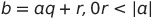

## Hi 410!

I'm Anne Louise! I am a second-semester senior majoring in Data Science and minoring in Mathematics! Looking forwards to this class!


### Quick About Me


```markdown
- I'm from Leesburg, Virginia
- I have two dogs, one of which my brother named after his favorite food, Taco🌮
 
- Played volleyball all four years at William & Mary


```


### Math Equation!
```markdown
**Division Algorithm**

```


### Fun Python Code!
```markdown
from datetime import date
 
def calculateAge(birthDate):
    today = date.today()
    age = today.year - birthDate.year -
         ((today.month, today.day) <
         (birthDate.month, birthDate.day))
 
    return age
     
print(calculateAge(date(2000, 5, 1)), "years")

> 21 years

```
Python program to Calculate age in Year. GeeksforGeeks. (2021, July 27). Retrieved February 3, 2022, from https://www.geeksforgeeks.org/python-program-to-calculate-age-in-year/ 


### Support or Contact

Having trouble with Pages? Check out our [documentation](https://docs.github.com/categories/github-pages-basics/) or [contact support](https://support.github.com/contact) and we’ll help you sort it out.
